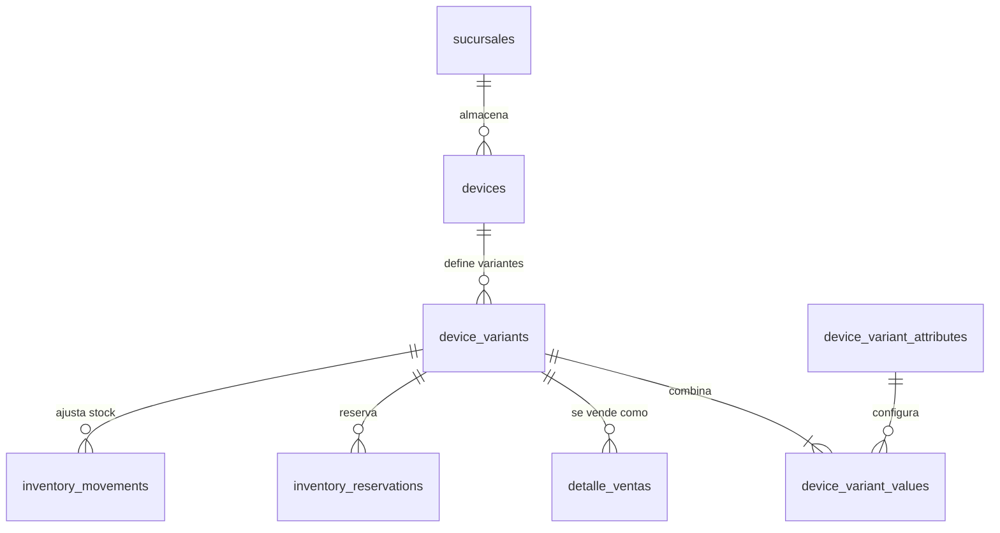
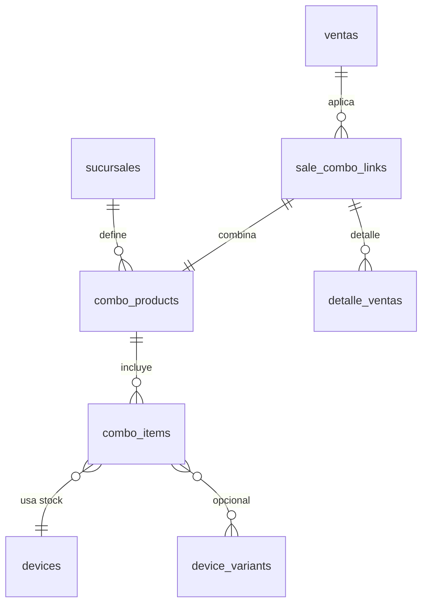
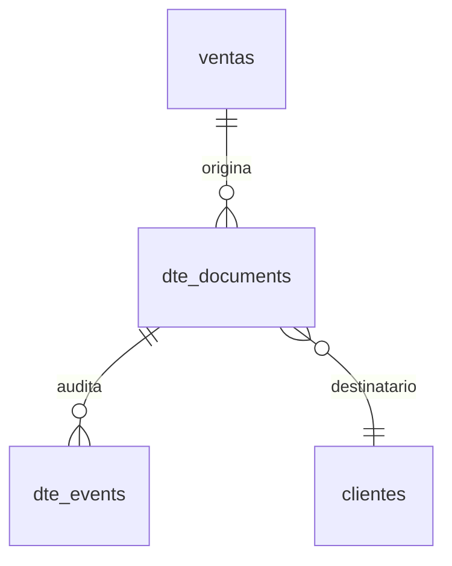
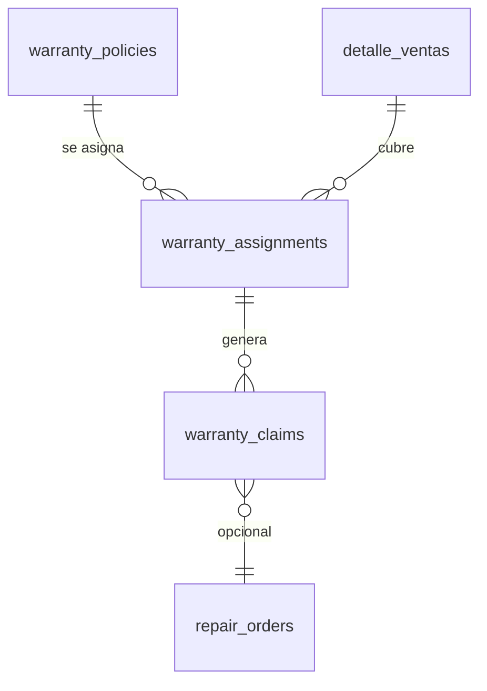
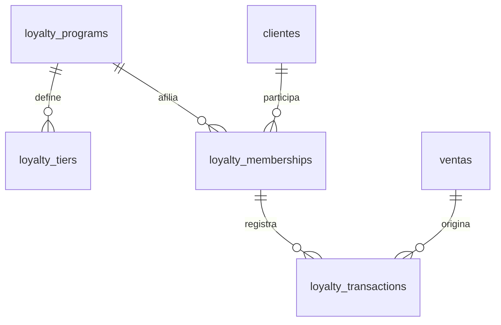

# Modelo de datos corporativo — Actualización variantes, combos y fidelización

Esta versión del modelo de datos incorpora las nuevas capacidades solicitadas (variantes de catálogo,
combos/complementos, emisión DTE, garantías extendidas y lealtad de clientes) manteniendo compatibilidad
con Softmobile 2025 v2.2.0. Las entidades previas permanecen intactas y los nuevos campos son opcionales,
con valores por defecto que preservan el comportamiento actual.

## Visión general del catálogo y variantes

- **Nuevas tablas**
  - `device_variants`: representa una combinación específica de atributos para un `devices.id` (SKU
    padre por sucursal). Campos clave: `id`, `device_id`, `variant_sku`, `barcode`, `attributes` (JSON con
    pares atributo/valor), `unit_price_override`, `is_default`, `is_active`, `created_at`, `updated_at`.
  - `device_variant_attributes`: catálogo de atributos disponibles por plantilla (`id`, `device_id`,
    `name`, `display_name`, `position`).
  - `device_variant_values`: valores concretos por atributo y variante (`id`, `variant_id`,
    `attribute_id`, `value`, `extra_cost`, `extra_price`).

- **Campos nuevos**
  - `devices.catalog_template_id` (nullable) referencia a plantillas maestras futuras sin impactar el flujo
    actual.
  - `inventory_movements.variant_id`, `inventory_reservations.variant_id` y `detalle_ventas.variant_id`
    (todos opcionales, `SET NULL`) para asociar movimientos, reservas y ventas a una variante específica
    sin romper consumos existentes.

## Combos y paquetes promocionales

- **Nuevas tablas**
  - `combo_products`: paquetes de venta (`id`, `store_id`, `name`, `combo_sku`, `description`,
    `base_price`, `is_active`, `valid_from`, `valid_until`).
  - `combo_items`: componentes del combo (`id`, `combo_id`, `device_id`, `variant_id`, `quantity`,
    `discount_percent`, `is_optional`).
  - `sale_combo_links`: relación muchos-a-muchos entre `ventas` y combos aplicados (`id`, `sale_id`,
    `combo_id`, `applied_price`, `notes`).

- **Campos nuevos**
  - `detalle_ventas.combo_id` (nullable) para vincular líneas individuales con un combo específico al
    momento de calcular descuentos distribuidos.
  - `ventas.combo_summary` (JSON) almacena un resumen del combo (identificadores, descuentos prorrateados)
    evitando consultas adicionales.

## Emisión de Documentos Tributarios Electrónicos (DTE)

- **Nuevas tablas**
  - `dte_documents`: registro maestro del comprobante (`id`, `sale_id`, `customer_id`, `document_type`,
    `folio`, `status`, `issued_at`, `sii_track_id`, `pdf_url`, `xml_payload`, `metadata`).
  - `dte_events`: bitácora de cambios de estado (`id`, `dte_id`, `status`, `detail`, `registered_at`,
    `registered_by`).

- **Campos nuevos**
  - `ventas.dte_status` (enum, default `PENDIENTE`) y `ventas.dte_reference` (nullable) para rastrear el
    estado sin consultar las tablas anexas.

## Garantías extendidas y gestión de reclamos

- **Nuevas tablas**
  - `warranty_policies`: catálogos de cobertura (`id`, `name`, `coverage_months`, `terms`, `provider`,
    `requires_registration`, `is_active`).
  - `warranty_assignments`: vínculo entre una línea vendida y su garantía (`id`, `sale_item_id`,
    `policy_id`, `serial_number`, `activation_date`, `expiration_date`, `status`, `activation_channel`).
  - `warranty_claims`: reclamos de clientes (`id`, `assignment_id`, `ticket_number`, `status`,
    `opened_at`, `resolved_at`, `resolution_notes`, `repair_order_id`).

- **Campos nuevos**
  - `detalle_ventas.warranty_status` (enum `SIN_GARANTIA`/`ACTIVA`/`VENCIDA`/`RECLAMADA`) para consultas
    rápidas.

## Programa de lealtad y recompensas

- **Nuevas tablas**
  - `loyalty_programs`: configuración general (`id`, `name`, `description`, `accrual_rate`,
    `redemption_rate`, `points_expiration_days`, `status`, `store_scope`).
  - `loyalty_tiers`: niveles del programa (`id`, `program_id`, `name`, `min_points`, `benefits_json`,
    `priority`).
  - `loyalty_memberships`: afiliaciones por cliente (`id`, `program_id`, `customer_id`, `current_tier_id`,
    `points_balance`, `lifetime_points`, `enrolled_at`, `status`).
  - `loyalty_transactions`: movimientos de puntos (`id`, `membership_id`, `sale_id`, `transaction_type`,
    `points_delta`, `balance_after`, `reason`, `registered_at`, `registered_by`).

- **Campos nuevos**
  - `ventas.loyalty_points_earned` y `ventas.loyalty_points_redeemed` (Decimal, default `0`).
  - `clientes.loyalty_opt_in` (Boolean, default `False`) para reflejar el consentimiento.

## Consideraciones de compatibilidad

- Todas las claves foráneas nuevas utilizan `SET NULL` o `RESTRICT` solo cuando la entidad principal no se
  elimina durante operaciones normales, manteniendo integridad con el inventario existente.
- Los campos añadidos a tablas actuales son nulos o cuentan con valores por defecto, por lo que no rompen
  consultas previas ni reportes.
- Los catálogos nuevos (`device_variant_attributes`, `warranty_policies`, `loyalty_programs`) se integran en
  cascada dentro de las mismas transacciones que ya manejan altas de catálogo y ventas, habilitando un
  despliegue gradual mediante *feature flags*.
