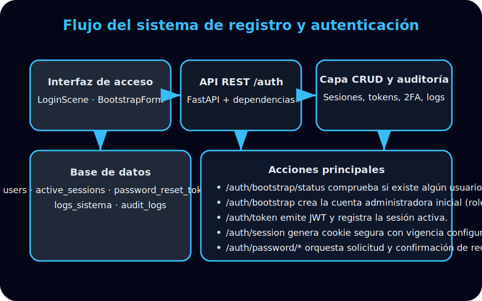

# Sistema de registro y autenticación

La plataforma Softmobile 2025 v2.2.0 utiliza un flujo de registro inicial controlado que asegura que solo exista una cuenta administradora antes de habilitar el resto de la aplicación. El diagrama siguiente resume los componentes principales:

## Componentes clave

- **Interfaz de acceso (frontend)**: el componente `LoginScene` alterna entre el formulario de ingreso y el formulario de registro inicial (`BootstrapForm`). La vista consulta `/auth/bootstrap/status` para decidir si debe mostrar la pestaña de “Crear cuenta inicial” y ejecuta `bootstrapAdmin` tras validar los campos obligatorios. Luego inicia sesión automáticamente utilizando el mismo usuario recién creado.
- **API REST /auth (backend)**: FastAPI expone los endpoints de bootstrap, emisión de tokens y manejo de sesiones. La ruta `/auth/bootstrap` garantiza que solo se pueda crear la cuenta inicial cuando no existen usuarios, incorpora el rol `ADMIN` de forma obligatoria y delega la creación al módulo `crud`.
- **Capa CRUD y auditoría**: el módulo `crud` controla el bloqueo/desbloqueo de intentos fallidos, registra éxitos/errores en `logs_sistema`, crea sesiones activas (`active_sessions`) y genera tokens de recuperación. También sincroniza el estado de 2FA cuando la función está habilitada.
- **Base de datos**: las tablas `users`, `active_sessions`, `password_reset_tokens`, `logs_sistema` y `audit_logs` almacenan las credenciales, sesiones, recuperaciones y eventos de auditoría asociados.

## Flujo principal

1. El cliente consulta `/auth/bootstrap/status` para saber si existe alguna cuenta. Si la respuesta indica `disponible=true`, muestra el formulario de registro inicial.
2. Al enviar el formulario, se invoca `/auth/bootstrap`, que crea la cuenta con contraseña hasheada, roles normalizados y privilegios de administrador.
3. Tras el registro, el cliente solicita `/auth/token` para obtener un JWT y registrar la sesión activa; alternativamente puede usar `/auth/session` para obtener una cookie segura.
4. Cuando un usuario necesita recuperar su acceso, `/auth/password/request` genera un token temporal y `/auth/password/reset` actualiza la contraseña, revoca sesiones activas y audita la acción.

Este flujo mantiene la compatibilidad retroactiva con versiones previas, respeta el modo estricto v2.2.0 y preserva la bitácora corporativa exigida por el mandato operativo.
